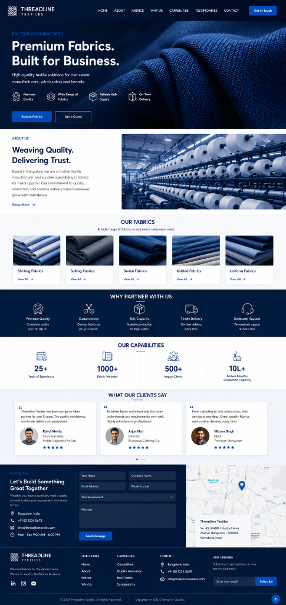

# Threadline Textiles - B2B Textile Manufacturer Website

A modern, responsive, high-performance website designed for **Threadline Textiles**, a premier B2B textile manufacturer and supplier specializing in fabrics for men's apparel.



## 🚀 Live Features

- **Hero Showcase**: High-impact display with brand proposition, key value highlights, and dual CTAs.
- **About Us**: Corporate heritage, Bangalore hub, and manufacturing quality guarantee.
- **Our Fabrics Catalog**: 5 Core categories (*Shirting, Suiting, Denim, Knitted, Uniform Fabrics*) with modal specification previews.
- **Why Partner With Us**: 5 pillars of B2B trust (*Premium Quality, Customization, Bulk Capacity, Timely Delivery, Dedicated Support*).
- **Our Capabilities**: Animated counter for business metrics (*25+ Years, 1000+ Varieties, 500+ Clients, 10L+ Meters Monthly Capacity*).
- **Client Testimonials**: Verified client reviews with 5-star ratings and interactive pagination.
- **Contact & Interactive Map**: Direct inquiry form with dynamic requirements dropdown, Leaflet.js interactive Peenya Bangalore location map, and floating address card.
- **Responsive Navigation & Footer**: Glassmorphism sticky header, mobile drawer menu, quick links, and newsletter subscription.

## 🛠️ Built With

- **HTML5**: Semantic and accessible markup.
- **CSS3**: Custom CSS variables, responsive grid & flexbox layouts, smooth animations, and glassmorphism.
- **JavaScript (ES6+)**: Interactive counters, mobile navigation drawer, testimonial controls, modal viewer, and form handling.
- **Leaflet.js & OpenStreetMap**: Interactive map integration.
- **Font Awesome 6**: Vector icons.
- **Google Fonts**: Plus Jakarta Sans display typography.

## 📂 Project Structure

```
Textile Website/
├── assets/
│   ├── images/
│   │   ├── about_factory.jpg
│   │   ├── avatar_arjun.jpg
│   │   ├── avatar_rahul.jpg
│   │   ├── avatar_vikram.jpg
│   │   ├── fabric_denim.jpg
│   │   ├── fabric_knitted.jpg
│   │   ├── fabric_shirting.jpg
│   │   ├── fabric_suiting.jpg
│   │   ├── fabric_uniform.jpg
│   │   ├── hero_fabric.jpg
│   │   └── map_preview.jpg
│   └── original_mockup.png
├── index.html
├── style.css
├── script.js
├── .gitignore
└── README.md
```

## 💻 How to Run Locally

1. Clone or download the repository:
   ```bash
   git clone https://github.com/srividya727/Textile-Website.git
   ```
2. Open `index.html` directly in any modern browser or serve via Live Server.

---
&copy; 2024 Threadline Textiles. All Rights Reserved.
